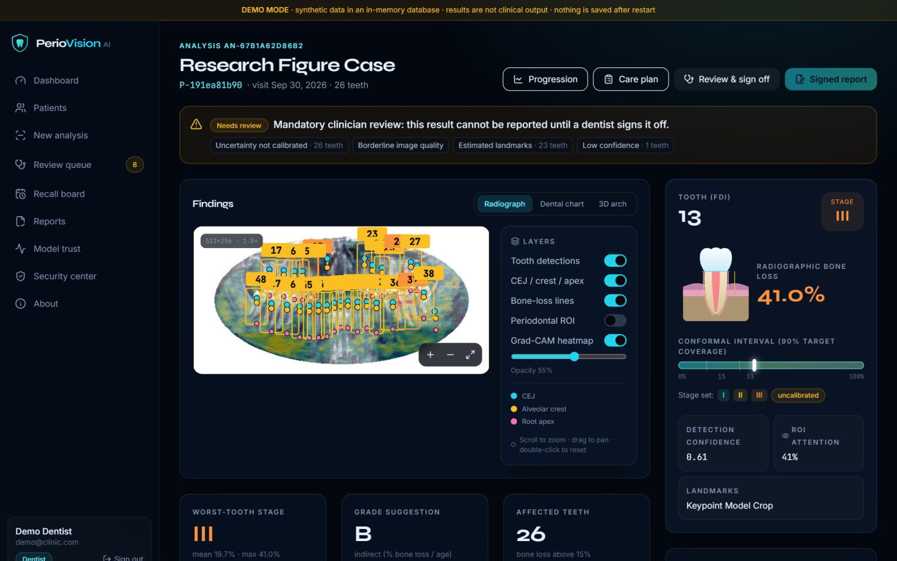
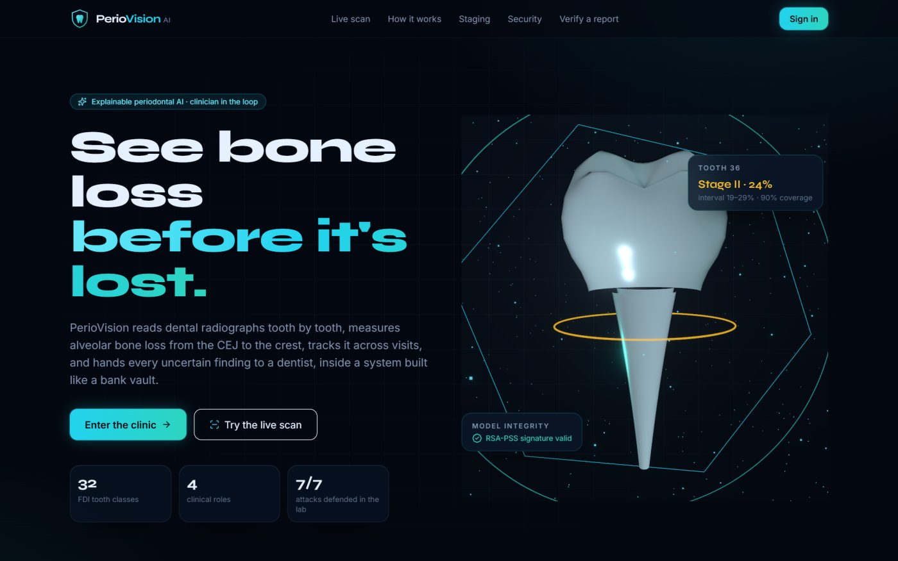
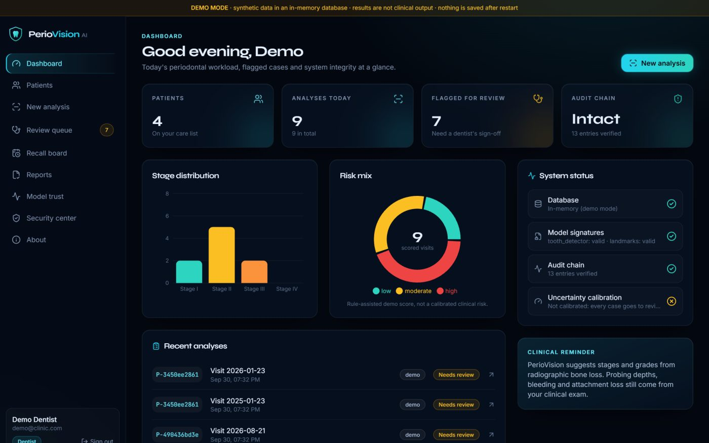
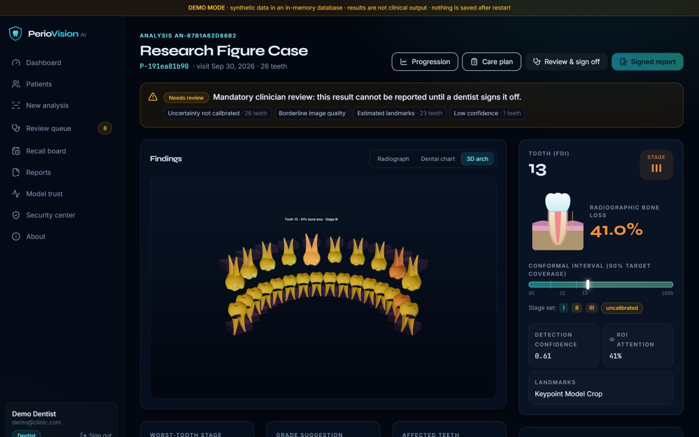
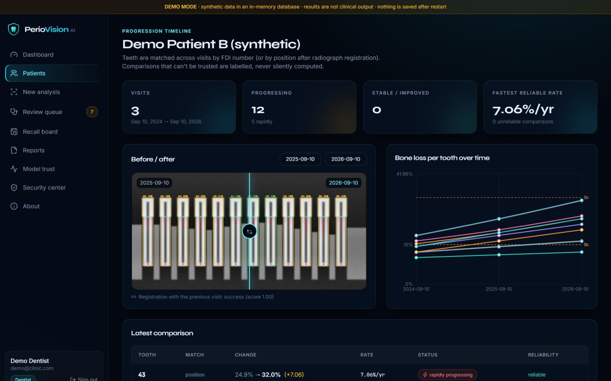
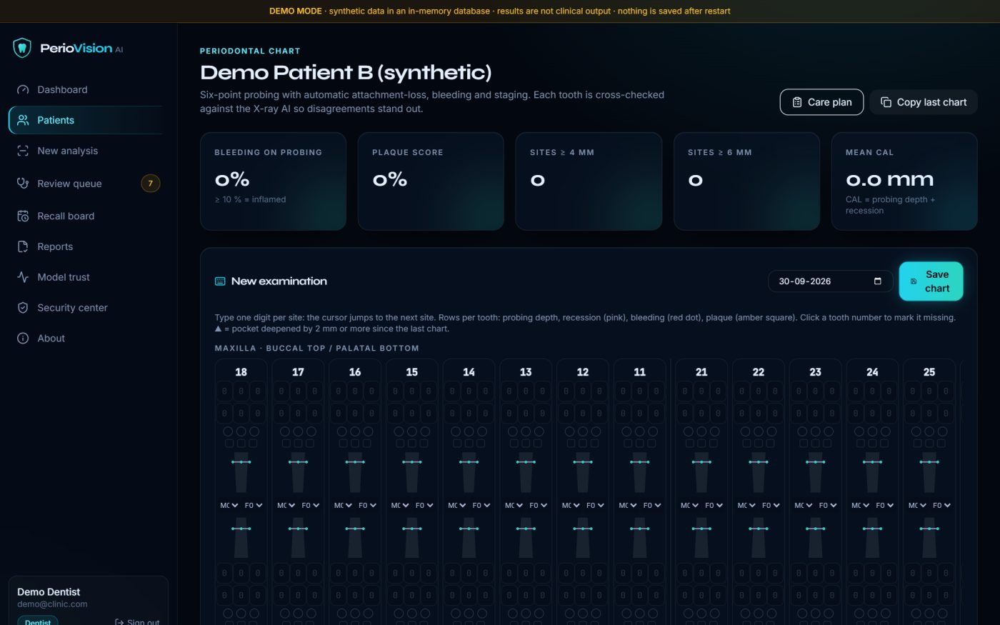
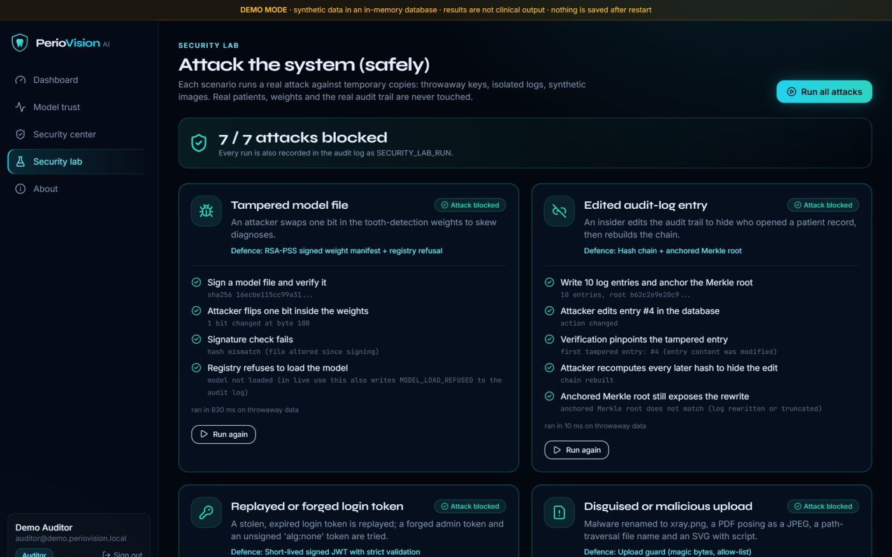

# PerioVision AI

**Secure, explainable decision support for periodontal bone-loss detection.** PerioVision reads dental radiographs tooth by tooth: it finds each tooth by FDI number, locates the cemento-enamel junction and the alveolar crest, measures bone loss, suggests a periodontitis stage and grade, tracks every tooth across visits, and puts an honest uncertainty range on each finding. Anything doubtful goes to a dentist for sign-off before a signed report can be issued. Around it sits a security layer built for a cybersecurity thesis: AES-256-GCM encryption, RSA-PSS signed models and reports, JWT + TOTP MFA, four-role RBAC with Zero Trust checks on every request, and a hash-chained, Merkle-anchored audit trail.

> **Decision support, clinician in the loop.** Not a certified medical device. Model accuracy is reported only from held-out test data (see the model card). Security controls are *aligned with* HIPAA safeguards, not certified.



| | |
|---|---|
|  |  |
|  |  |
|  |  |

## Features

**Clinical AI (synopsis objectives O1–O5)**
- Image-quality gate, CLAHE, YOLO11m tooth detection with FDI numbers, CEJ / crest / apex landmarks
- Per-tooth bone loss %, Stage I–IV and Grade A–C suggestions (2017 AAP/EFP)
- Grad-CAM heatmaps with a periodontal-region attention check
- Adaptive split-conformal uncertainty (each tooth's interval widens when its normal and mirrored readings disagree), stage sets, mandatory clinician review router
- Longitudinal progression with registration that must line up the teeth themselves, plus a measurement-error rule: changes smaller than the error are never called progression
- Clinical risk model trained on CDC NHANES (validated on a later survey cycle), with plain-language odds ratios
- Panoramic films: tooth detection and FDI numbering (validated on an external hospital's data); bone loss is measured on periapical films only
- No invented numbers: anything unmeasured shows as "not measured" or "insufficient data", enforced by a build-time test

**Security (O6)**
- AES-256-GCM with key IDs and rotation for fields, radiographs and reports
- RSA-PSS signed model manifest (unsigned models refused) and signed, QR-verifiable PDF reports
- bcrypt, 15-minute JWT + rotating refresh cookie, TOTP MFA, lockout, rate limits
- Admin / dentist / technician / auditor permission matrix, Zero Trust request guard, decoy records
- Tamper-evident audit log that pinpoints the first edited entry; Security Lab with 7 live attack demos

**Clinical workflow (O7) and chairside tools**
- Login → patient → upload → analysis → review → signed report → audit, in a React app with 3D visuals
- Six-point periodontal chart with clinical-vs-radiographic concordance, EFP care plan with prognosis and referral letter, patient explainer with a "what if" forecast, clinic recall board

## Architecture

```
React app (frontend/) ──HTTPS──▶ Flask API (backend/app)
                                  ├─ Zero Trust guard → RBAC permission → route
                                  ├─ ml/: quality → CLAHE → YOLO11m → landmarks → staging → Grad-CAM → conformal → risk
                                  ├─ security/: AES-GCM · RSA-PSS · JWT/MFA · audit chain · upload guard
                                  └─ MongoDB (or in-memory demo DB) + encrypted blob store + external audit anchors
```
Full diagram and data flow: [docs/ARCHITECTURE.md](docs/ARCHITECTURE.md).

## Run it (step by step, Windows)

1. **Install the tools** (once):
   - Python 3.11 or newer: https://www.python.org/downloads/ (tick "Add python.exe to PATH")
   - Node.js 20 or newer (LTS): https://nodejs.org/
2. **Open PowerShell in the project folder** (`Dental_progression`).
3. **Create your settings file:**
   ```powershell
   copy .env.example .env
   ```
   Open `.env` and set `DB_MODE=demo`. Generate each secret with `python -c "import secrets; print(secrets.token_hex(32))"` and paste it in. Then fill in the `DEMO_*` accounts. Passwords need 10+ characters with upper- and lower-case letters and a digit, and these accounts are for demos only.
4. **Install everything:**
   ```powershell
   .\run.ps1 setup
   ```
5. **Start the backend** (terminal 1):
   ```powershell
   .\run.ps1 demo
   ```
6. **Start the web app** (terminal 2):
   ```powershell
   .\run.ps1 frontend
   ```
7. **Open http://localhost:5173** and sign in with a `DEMO_*_EMAIL` / `DEMO_*_PASSWORD` from your `.env`.

On macOS/Linux use `make setup`, `make demo`, `make frontend`, `make test`.

**Ports:** backend `5000`, frontend `5173`. **API docs:** http://127.0.0.1:5000/api/docs (OpenAPI) and [docs/API.md](docs/API.md).
**Tests:** `.\run.ps1 test` (backend) and `cd frontend; npm run build; npm run lint`. With trained weights in `backend/weights/`, `cd backend; python -m pytest tests_live -q` also checks the real models on real radiographs (see `docs/VERIFICATION_REPORT.md`).

### Demo tour
1. Landing page: drag the scan bar across the panoramic X-ray; move the staging slider.
2. Sign in as the **dentist**: Dashboard → Patients → *Demo Patient B* → Progression, Perio chart (see the discordant teeth), Care plan, Explain to patient.
3. Open an analysis: switch between Radiograph, Dental chart and 3D arch; click teeth.
4. Review queue: correct a tooth and sign off; then generate a **Signed report** and verify it.
5. Sign in as the **auditor**: Security center → Verify chain; Security lab → Run all attacks.

### Optional: real models and HTTPS
- Train on a free Colab GPU with the notebooks in `notebooks/` (tooth detector, landmarks, panoramic models; see `notebooks/README.md`), then run `.\run.ps1 install-models -From <export folder>` (installs, signs, tests). Or put weights in `backend/weights/` and run `cd backend; python scripts/sign_model.py`. Unsigned files are refused.
- Calibrate uncertainty on a held-out, per-tooth-annotated set: `python scripts/calibrate_conformal.py --images … --labels …`.
- Live deployment (fresh secrets, real MongoDB, production server): see [docs/DEPLOYMENT.md](docs/DEPLOYMENT.md).
- Local HTTPS: `python scripts/make_dev_cert.py`, then set `TLS_CERT=keys/dev-tls.crt` and `TLS_KEY=keys/dev-tls.key` in `.env`.

## Troubleshooting

| Problem | Fix |
|---|---|
| `Cannot reach the PerioVision server` in the browser | The backend isn't running: start `.\run.ps1 demo` first. |
| Backend exits saying a key is missing | Fill in `JWT_SECRET_KEY`, `AUDIT_ANCHOR_KEY` and `FIELD_ENCRYPTION_KEY` in `.env` (demo mode tolerates missing ones). |
| Login says "Invalid email or password" | Use the exact `DEMO_*` values from `.env`; demo data resets on every backend restart. |
| "Account locked" | 5 wrong passwords lock an account for 15 minutes; restart the demo backend to reset. |
| Everything says "Mandatory clinician review" / "uncalibrated" | Expected until the model is calibrated on annotated data; see the model card. |
| 3D scenes don't show | Your device has no WebGL, few CPU cores, or reduced motion on; a static image is shown instead. |
| `.\run.ps1` is blocked | Run `Set-ExecutionPolicy -Scope CurrentUser RemoteSigned` once, or run the commands inside `run.ps1` by hand. |

## Known limitations (honest)

- Measured on held-out data ([docs/MODEL_CARD.md](docs/MODEL_CARD.md); re-run commands in [docs/VERIFICATION_REPORT.md](docs/VERIFICATION_REPORT.md)): tooth detector 95.8 % mAP@0.5 on DENTEX and 91 % found-and-correctly-numbered on an external hospital's films; periapical bone-loss error 7.4 points, 73 % stage agreement, 92 % interval coverage (DenPAR).
- Panoramic bone loss is **not** reported: against expert grading of 240 panoramic films (BRAR) it was not accurate enough. `notebooks/train_panoramic_colab.ipynb` trains the next attempt.
- Uncertainty intervals are honest but wide (on average ±19 points at 90 %), so most teeth still go to dentist review.
- The risk model estimates current disease from clinical factors (AUC 0.65); it does not use the radiograph or predict progression.
- Demo mode uses an in-memory database; nothing persists after a restart.
- The development server is HTTP unless you enable the local certificate; production needs a TLS reverse proxy.

## Documentation

[Architecture](docs/ARCHITECTURE.md) · [Security](docs/SECURITY.md) · [API](docs/API.md) · [Deployment](docs/DEPLOYMENT.md) · [Model card](docs/MODEL_CARD.md) · [Datasets](docs/DATASETS.md) · [Verification report](docs/VERIFICATION_REPORT.md) · [Instructions for use](docs/INSTRUCTIONS_FOR_USE.md) · [Key rotation](docs/KEY_ROTATION.md) · [Traceability](docs/TRACEABILITY.md) · [Project report](docs/PROJECT_REPORT.md) · [All docs](docs/README.md)

## Repository layout

```
backend/        Flask API
  app/          api/ (routes) · services/ (workflow) · ml/ (models, uncertainty, risk) · security/ · models/ (DB) · schemas/
  config/       thresholds.json: every clinical / ML threshold in one place
  scripts/      training, evaluation, calibration, signing and setup tools
  tests/        fast test suite (no weights needed) · tests_live/: checks with the real trained models
  weights/      model files (not in git; see weights/README.md) · keys/: signing keys (not in git)
frontend/       React 18 + Vite + TypeScript web app
notebooks/      one-click Colab training notebooks
docs/           documentation, evidence/ (raw evaluation outputs), reference/screenshots/
data/           local data, gitignored (sample/ = synthetic demo images)
run.ps1 · Makefile · docker-compose.yml   run / build / deploy entry points
```
