# Thesis analyses

_Generated by `python -m research.thesis_analyses` on 2026-10-07 from the files in `docs/evidence/predictions/`. Do not edit by hand; re-run the script._

## 1. Where the periapical model makes its errors

DenPAR test, app pipeline, corrected reference: 553 measured teeth in 199 films. Intervals resample whole films. Groups with overlapping intervals are not shown to differ.

| Arch | teeth (films) | Bone-loss error, points (95 % CI) | Stage agreement (95 % CI) |
|---|---|---|---|
| Upper | 218 (79) | 6.09 (5.02-7.23) | 77.5 % (72.0-83.4) |
| Lower | 335 (120) | 6.99 (5.90-8.17) | 74.9 % (70.0-79.5) |

| Region | teeth (films) | Bone-loss error, points (95 % CI) | Stage agreement (95 % CI) |
|---|---|---|---|
| Anterior | 160 (50) | 7.12 (5.44-9.03) | 80.6 % (73.8-87.4) |
| Posterior (left / right) | 393 (149) | 6.44 (5.62-7.42) | 74.0 % (69.5-78.3) |

| Reference stage | teeth (films) | Bone-loss error, points (95 % CI) | Stage agreement (95 % CI) |
|---|---|---|---|
| I | 294 (129) | 4.79 (4.18-5.43) | 85.4 % (80.9-89.5) |
| II | 144 (94) | 7.26 (6.15-8.51) | 52.1 % (43.4-60.8) |
| III | 115 (58) | 10.56 (8.19-13.20) | 81.7 % (72.6-90.2) |

| Image sharpness (tertile) | teeth (films) | Bone-loss error, points (95 % CI) | Stage agreement (95 % CI) |
|---|---|---|---|
| low | 186 (67) | 6.15 (4.90-7.48) | 79.6 % (72.8-85.9) |
| middle | 191 (66) | 6.56 (5.27-8.14) | 77.0 % (71.1-82.5) |
| high | 176 (66) | 7.24 (5.82-8.78) | 71.0 % (64.1-77.1) |

| Image contrast (tertile) | teeth (films) | Bone-loss error, points (95 % CI) | Stage agreement (95 % CI) |
|---|---|---|---|
| low | 196 (67) | 5.75 (4.55-7.09) | 77.0 % (71.0-83.2) |
| middle | 189 (66) | 6.00 (5.09-6.95) | 77.2 % (70.8-83.5) |
| high | 168 (66) | 8.39 (6.65-10.36) | 73.2 % (66.3-79.9) |

DenPAR does not label restorations, implants or overlapping teeth, so those groups cannot be measured on periapical films here. They are measured on panoramic films below (BRAR records them per patient).

### Panoramic worst-tooth estimate (BRAR test, one film per patient)

| Missing teeth | patients (films) | Bone-loss error, points (95 % CI) | Stage agreement (95 % CI) |
|---|---|---|---|
| none | 96 (96) | 8.92 (6.97-11.44) | 64.6 % (55.2-74.0) |
| 1 or more | 53 (53) | 15.79 (11.86-20.20) | 75.5 % (62.3-86.8) |

| Implants | patients (films) | Bone-loss error, points (95 % CI) | Stage agreement (95 % CI) |
|---|---|---|---|
| none | 134 (134) | 11.54 (9.41-13.76) | 67.2 % (59.0-74.6) |
| 1 or more | 15 (15) | 9.86 (4.91-15.84) | 80.0 % (53.3-100.0) |

| Residual roots | patients (films) | Bone-loss error, points (95 % CI) | Stage agreement (95 % CI) |
|---|---|---|---|
| none | 137 (137) | 10.37 (8.44-12.44) | 67.2 % (58.4-75.2) |
| 1 or more | 12 (12) | 22.76 (12.99-33.45) | 83.3 % (58.3-100.0) |

| Age | patients (films) | Bone-loss error, points (95 % CI) | Stage agreement (95 % CI) |
|---|---|---|---|
| under 40 | 88 (88) | 7.58 (6.33-8.99) | 65.9 % (56.8-75.0) |
| 40-59 | 43 (43) | 14.09 (9.72-19.54) | 67.4 % (53.5-81.4) |
| 60 and over | 18 (18) | 23.42 (16.34-30.54) | 83.3 % (66.7-100.0) |

| Reference stage | patients (films) | Bone-loss error, points (95 % CI) | Stage agreement (95 % CI) |
|---|---|---|---|
| I | 33 (33) | 6.45 (4.30-8.82) | 78.8 % (63.6-90.9) |
| II | 62 (62) | 6.94 (5.66-8.31) | 56.5 % (43.5-69.4) |
| III | 54 (54) | 19.45 (15.09-23.96) | 75.9 % (63.0-87.0) |

**Reading the tables.**
- **Severity is the main driver.** Error rises with the reference stage on both film types (periapical 4.8 / 7.3 / 10.6 points for stage I / II / III; panoramic 6.5 / 6.9 / 19.5): severe bone loss is underestimated, which the asymmetric uncertainty interval accounts for.
- **Stage II is the hardest stage to call** (about half correct on both film types), because its band is only 18 points wide.
- **Missing teeth, residual roots and older age** go with much larger panoramic errors, but those patients also have more severe disease, so these groups are confounded with severity and are not separate effects.
- **Image quality:** high-contrast films show a somewhat higher error than low-contrast ones, with overlapping intervals (a hint, not a finding); sharpness shows no clear pattern. Upper vs lower arch and front vs back teeth do not differ clearly.
- Small groups (implants: 15 patients; residual roots: 12) have very wide intervals; do not read a difference into them.

## 2. How landmark error turns into bone-loss error

Each landmark of the 588 reference test teeth is moved by random noise of a given size (Gaussian, SD as % of the tooth's root length), one landmark at a time, and the resulting change in bone loss is measured (points). Seeded simulation on the specialist labels; no model involved.

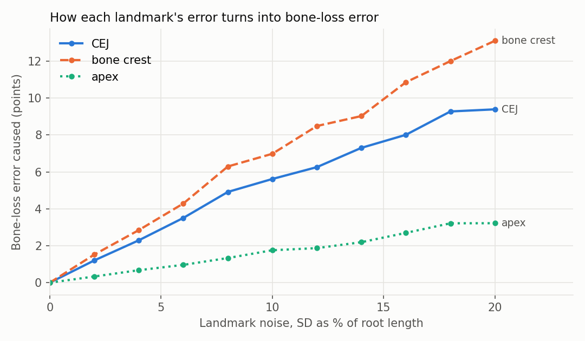

| Noise SD (% of root length) | CEJ | Bone crest | Apex | All three |
|---|---|---|---|---|
| 0 | 0.00 | 0.00 | 0.00 | 0.00 |
| 4 | 2.30 | 2.85 | 0.68 | 3.98 |
| 6 | 3.51 | 4.29 | 0.96 | 5.66 |
| 10 | 5.62 | 6.98 | 1.76 | 9.02 |
| 14 | 7.30 | 9.03 | 2.19 | 11.03 |
| 20 | 9.39 | 13.10 | 3.22 | 15.84 |

**Reading it.** The bone crest matters most, then the CEJ, because bone loss is their distance along the root; the apex only scales that distance (a 10 % apex error costs under 2 points). The deployed model's measured same-side errors are about 6 % (CEJ), 10 % (crest) and 4.5 % (apex) of root length; in this simulation errors of that size produce several points of bone-loss error, the same order as the 6.6 points measured on the test set (real errors are not purely random, so this is a guide, not an exact decomposition). Improving the **crest** point is therefore the most direct way to lower the error, and to make progression detection more sensitive.

## 3. Accuracy versus coverage: when to refer a tooth to a dentist

Teeth are ordered by the width of their calibrated uncertainty interval (narrow = the model is consistent with itself). Reporting only the most certain teeth automatically and referring the rest shows how much accuracy the referral rule buys. Same test teeth as above; intervals resample whole films.

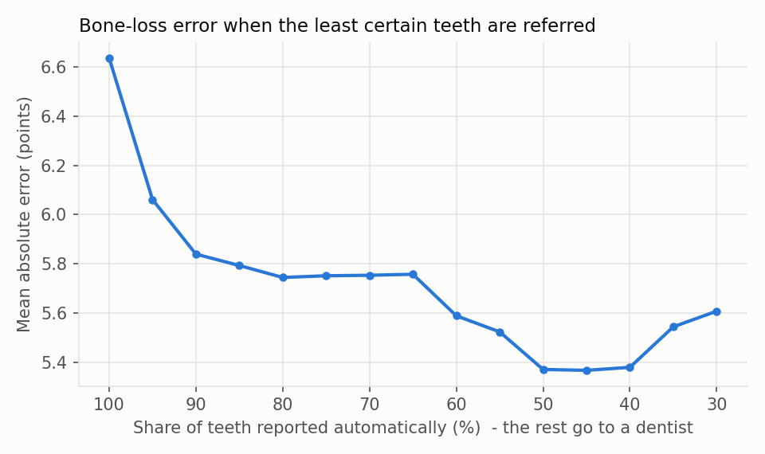

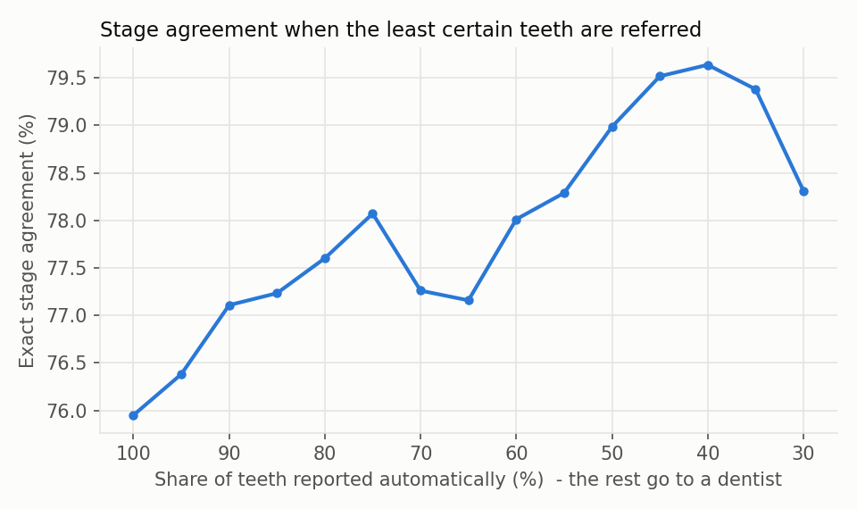

| Teeth reported automatically | Referred to a dentist | Bone-loss error (95 % CI) | Stage agreement (95 % CI) | Interval half-width cut-off |
|---|---|---|---|---|
| 100 % | 0 % | 6.64 (5.86-7.49) | 75.9 % (72.3-79.4) | none |
| 90 % | 10 % | 5.84 (5.21-6.54) | 77.1 % (73.3-80.8) | up to 29.4 points |
| 80 % | 20 % | 5.75 (5.08-6.51) | 77.6 % (73.5-81.6) | up to 23.5 points |
| 70 % | 30 % | 5.75 (5.04-6.55) | 77.3 % (73.0-81.3) | up to 20.5 points |
| 60 % | 40 % | 5.59 (4.86-6.40) | 78.0 % (73.5-82.3) | up to 18.6 points |
| 50 % | 50 % | 5.37 (4.65-6.19) | 79.0 % (73.8-83.7) | up to 16.9 points |

**Reading it.** Referring the least certain 10 % of teeth lowers the error of the rest from 6.6 to 5.8 points; referring more helps little (5.4 points when half are referred), and stage agreement rises only from 76 % to 79 %. The interval width is a real but partial confidence score: it flags the worst teeth, not every wrong one. A practical rule is therefore: report automatically only teeth with a 90 % interval half-width up to about 29 points, and refer the rest. The app goes further and already sends every tooth whose stage is uncertain (more than one stage in its prediction set) to dentist review.

## 4. Gallery: good, typical and failure cases

Each panel shows a DenPAR test film (CC BY 4.0) with, per measured tooth, the specialist reference points as filled circles (blue CEJ, orange bone crest, aqua apex) and the model's points as white crosses joined to them by a thin line. The caption gives the film's mean bone-loss error. Films were chosen by error rank (lowest three, middle three, highest three), not by hand.

### Good cases

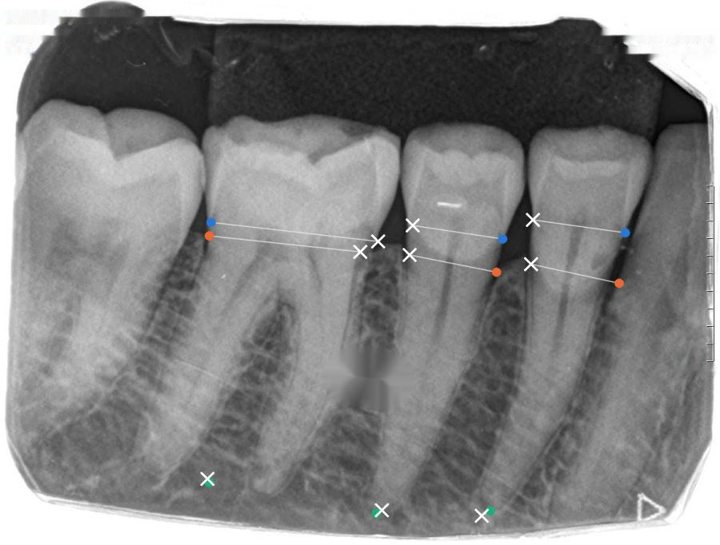

Film `389.jpg`: mean error 0.8 points over 3 teeth; stage reference->model: I->I, I->I, II->I.

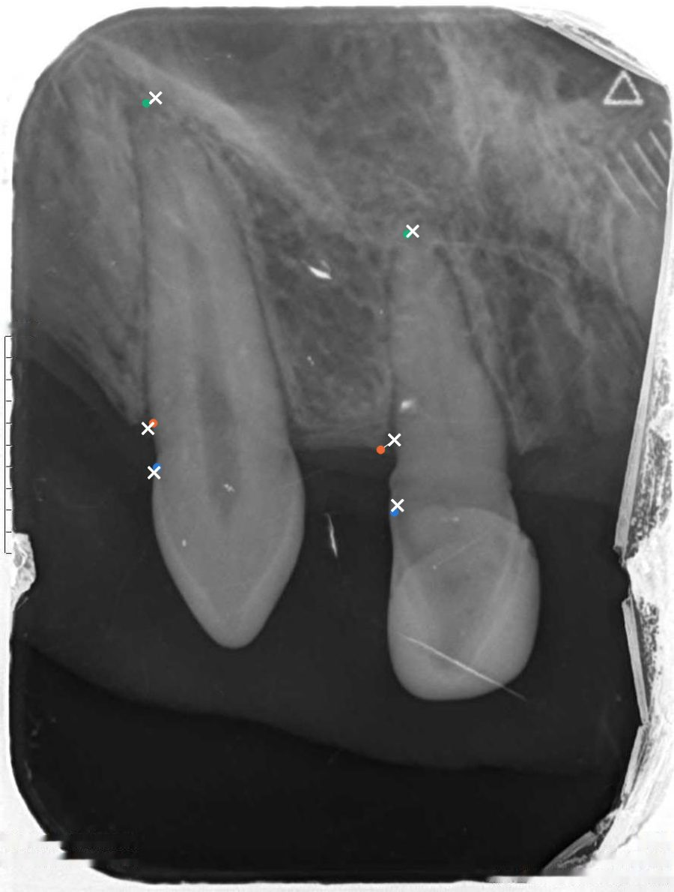

Film `495.jpg`: mean error 0.9 points over 2 teeth; stage reference->model: II->II, I->I.

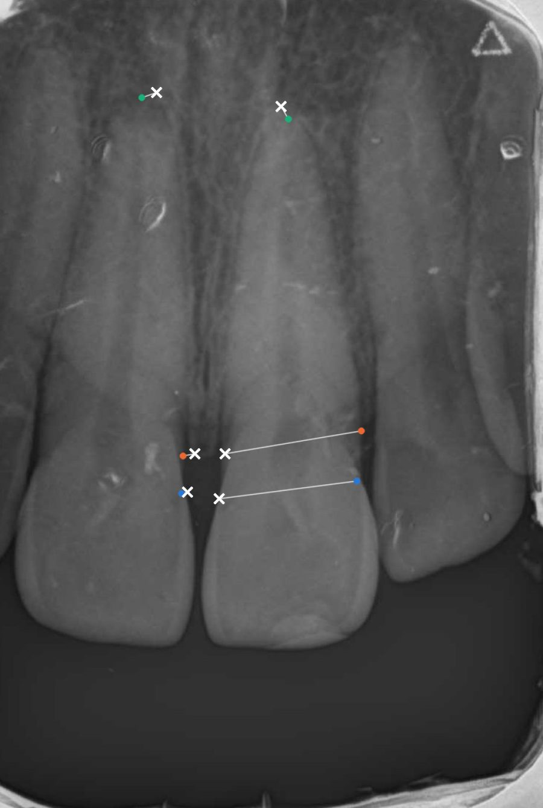

Film `808.jpg`: mean error 0.9 points over 2 teeth; stage reference->model: I->I, I->I.

### Typical cases

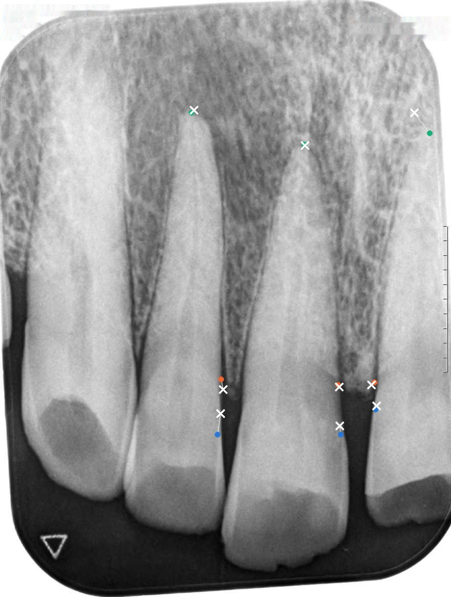

Film `228.jpg`: mean error 4.9 points over 3 teeth; stage reference->model: II->I, II->I, I->I.

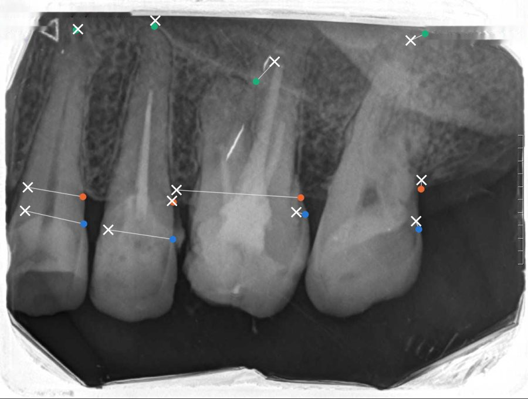

Film `1082.jpg`: mean error 5.0 points over 4 teeth; stage reference->model: I->II, II->II, II->II, I->I.

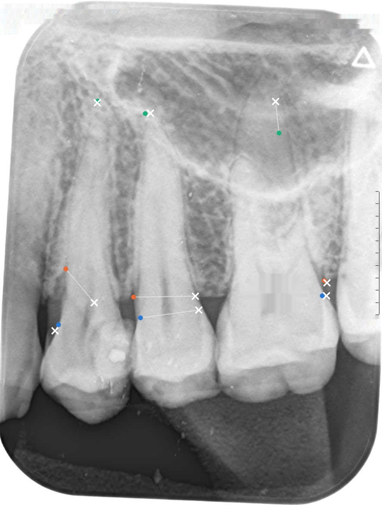

Film `244.jpg`: mean error 5.0 points over 3 teeth; stage reference->model: II->I, I->I, I->I.

### Failure cases

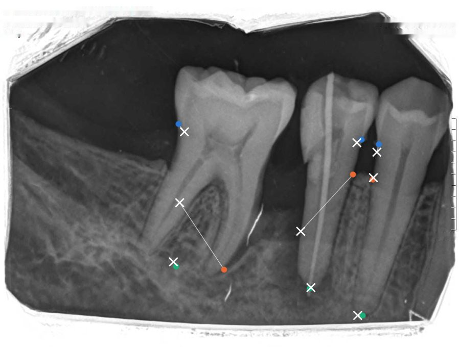

Film `567.jpg`: mean error 31.5 points over 3 teeth; stage reference->model: III->III, II->III, II->II.

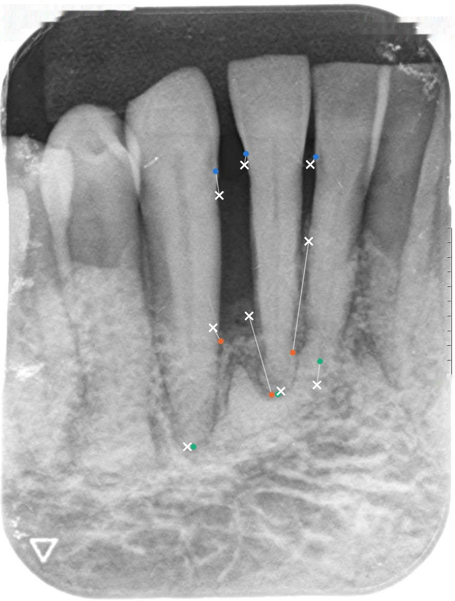

Film `125.jpg`: mean error 34.8 points over 3 teeth; stage reference->model: III->III, III->III, III->III.

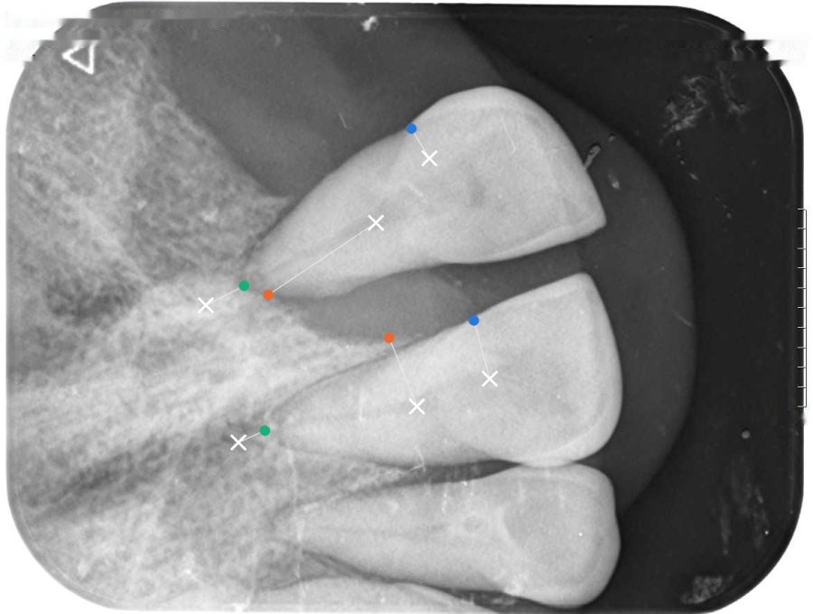

Film `915.jpg`: mean error 35.2 points over 2 teeth; stage reference->model: III->II, III->II.

**Reading it.** In the failure cases the model places the bone crest too far toward the crown on teeth with deep bone loss (the severe-case underestimation measured above), and one failure film is taken at an unusual sideways orientation. In the good and typical cases the points sit close to the specialist's. Look at these panels before trusting a single number on a severely affected tooth.
